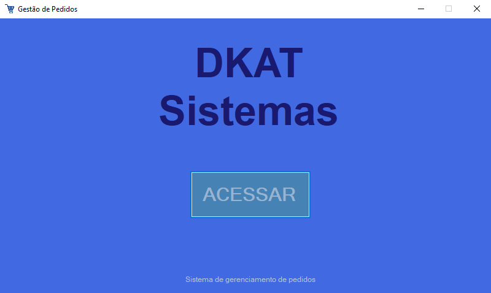
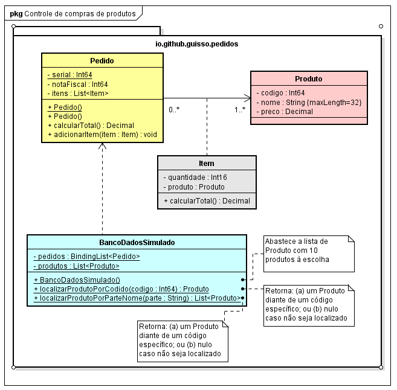
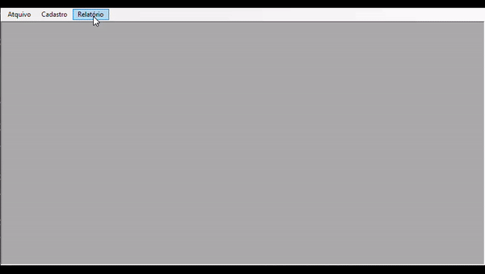

<h1 align="center">Gestão de pedidos</h1> 

    
    

 

    

<h2>&#X1F4DD Descrição do projeto</h2>

Baseando-se no diagrama UML abaixo, o projeto consiste na criação de uma <b>GUI</b> para fazer um mini programa que gerencia pedidos de um supermercado, usando um Banco de Dados estático e o usuário faz um pedido que é adicionado a uma uma lista de pedidos gerando uma Nota Fiscal.

    

<h2>&#X1F6A7 Exemplo feito pelo professor</h2>

    

<a href="Exemplo/ControlePedidosCliente.exe" download="ControlePedidosCliente">download do arquivo.exe</a>

<h2>&#X1F528 Funcionalidades do projeto</h2>

<ul>
    <li>Tela de acesso com botão para acessar a janela principal</li>
    <li>Tela principal com um MenuStrip para acesso ao sair e as outras janelas</li>
    <li>Menu de Cadastro com acesso aos pedidos</li>
    <li>Botão de acesso a janela para cadastrar um novo pedido</li>
    <li>Campos de busca por código e nome do produto</li>
    <li>Menu Relatório com acesso aos produtos</li>

</ul>

    

<h2>&#X1F4C1 Acesso ao projeto</h2>

Acesse o <a href="https://github.com/DKAT-DAVI/gestao-de-pedidos-Csharp">repositório do projeto</a> e faça download do repositório, seja via <a href="https://github.com/DKAT-DAVI/gestao-de-pedidos-Csharp/archive/refs/heads/main.zip">arquivo.zip</a> ou fazendo um git clone do repositório na sua máquina e compile o programa usando o <a href="https://visualstudio.microsoft.com/downloads/">Visual Studio</a>.

<h2>&#X2714 Técnicas e Tecnologias utilizadas</h2>
<ul>
    <li>
        Linguagem C#
    </li>
    <li>    
        
        Visual Studio  
    </li>
    <li><bigger><b>POO</b></bigger> programação orientada a obejtos</li>

</ul>

<h2>&#X1F4DE Contato</h2>

    <ul>
        <li>dkatdavi@gmail.com</li>
        <li><a href="https://www.linkedin.com/in/dkat-davi/">Linkedln</a> </li>    
    </ul>
    <a href="https://github.com/dkat-davi">
        
BY DKAT

    </a>

<footer align="justify">
    
Projeto da matéria de Programação Visual atribuido pelo professor <a href="https://github.com/guisso">Luis Guisso<a> do IFNMG - Montes Claros com o intuito de testar os conhecimentos em <b>POO</b>, <b>C#</b> e criação de interfaces.
<footer>
